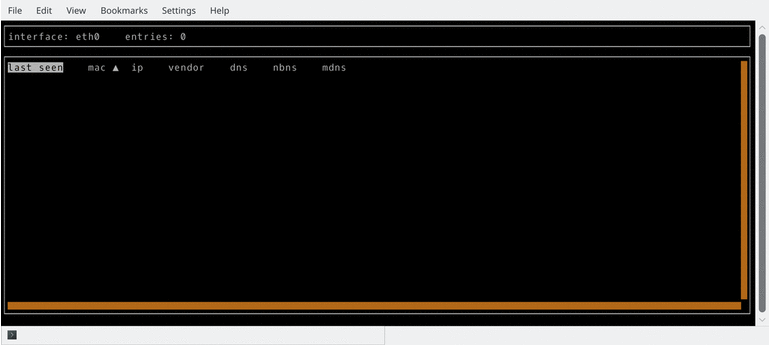

# landiscover

[](https://travis-ci.org/aler9/landiscover)
[](https://goreportcard.com/report/github.com/aler9/landiscover)
[](https://hub.docker.com/r/aler9/landiscover)



Landiscover is a command-line tool that allows to discover devices and services available in the local network.

Features:
* Discover devices and services within seconds
* Available for Linux, no external dependencies

This software combines multiple discovery techniques:
* Arping is used to find machines
* DNS protocol is used to find hostnames
* Multicast DNS (MDNS) is used to find machines and hostnames
* NetBIOS protocol is used to find machines and hostnames

## Installation and usage

Install and run with Docker:
```
docker run --rm -it --network=host aler9/landiscover
```

Alternatively, you can download and run a precompiled binary from the [release page](https://github.com/aler9/landiscover/releases).

## Full command-line usage

```
usage: landiscover [<flags>] [<interface>]

landiscover v0.0.0

Machine and service discovery tool.

Flags:
  --help     Show context-sensitive help (also try --help-long and --help-man).
  --passive  do not send any packet

Args:
  [<interface>]  Interface to listen to

```
